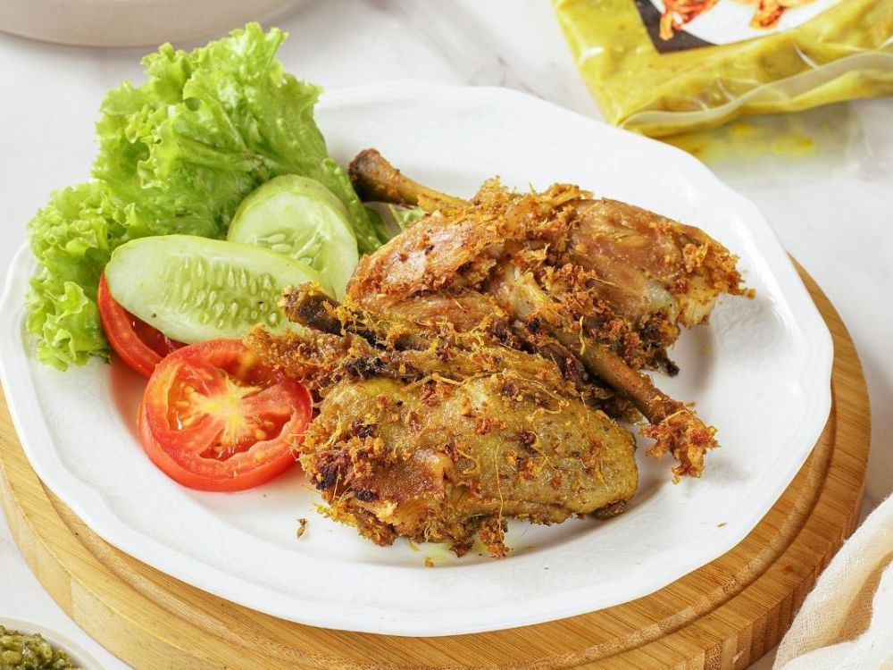

# Ayam Ungkep

- 4 pcs paha ayam atau 2 pcs paha utuh
- 1 bungkus bumbu racik ayam goreng/ayam bumbu rempah
- 300 ml air

1. Masukkan bumbu racik dan air, aduk sampai rata.
2. Kerat-kerat ayam agar bumbu dapat masuk ke daging.
3. Masukkan ayam mentah, nyalakan api sedang.
4. Jika menggunakan ayam frozen, jangan lupa pisahkan ayam yang saling menempel setelah dimasak beberapa saat.
5. Jika air sudah hampir habis, matikan api dan dinginkan ayam.
6. Bisa disimpan di kulkas (tahan 1 minggu) atau langsung digoreng.
7. Goreng dengan api sedang kurang lebih 10 menit agar bagian dalam ayam matang sempurna.
