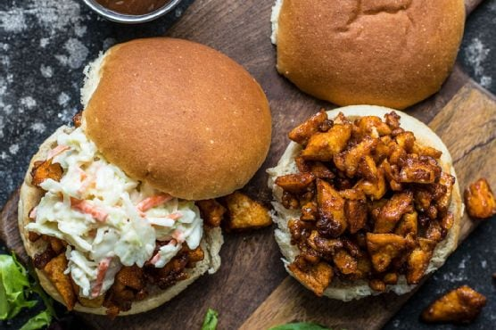

# BBQ Tofu Sliders

- BBQ Tofu
  - 14 oz. block firm or extra firm tofu
  - 1 tsp smoked paprika
  - 1/4 tsp garlic powder
  - 1/2 tsp salt
  - freshly cracked pepper
  - 1 Tbsp cornstarch
  - 2 Tbsp cooking oil
  - 1/4 cup BBQ Sauce
- Simple Coleslaw
  - 1/2 lb. shredded cabbage slaw mix* (about 3 cups)
  - 1/3 cup mayonnaise
  - 1/2 Tbsp honey
  - 1 tsp Dijon mustard
  - 1 tsp apple cider vinegar
  - 1/4 tsp salt
  - Freshly cracked pepper
- For Serving
  - 3 Tbsp BBQ sauce
  - 3 Buns

1. OPTIONAL: Freeze the tofu at least a day before, then thaw before pressing. This gives the tofu a more firm and less jelly-like texture.
2. Remove the tofu from the package and place it on a baking sheet. Place a cutting board or a smaller baking sheet on top, then place something heavy on top, like a pot full of water, or a cast iron skillet. Allow the tofu to press for about 30 minutes to remove excess water. (If you previously froze the tofu, you can press for about half the time because the water comes out much more quickly.)
3. Once pressed, transfer the tofu to a cutting board and roughly chop into random 1/2-inch sized pieces. Place the chopped tofu in a bowl.
4. In a separate small bowl, stir together the smoked paprika, garlic powder, salt, and some freshly cracked pepper. Sprinkle this over the tofu, then gently stir the tofu until it is coated in the spices.
5. Add 1 tsp cornstarch to the tofu and gently fold until coated. Repeat two more times until 1 Tbsp cornstarch total has been added to the tofu.
6. Heat 2 Tbsp cooking oil in a large non-stick skillet over medium heat (cast-iron or teflon, your choice). Once the oil is very hot, add the tofu to the skillet. Let the tofu cook, stirring only occasionally, for about ten minutes, or until it appears firm and darkened on the outside edges.
7. Remove the tofu from the heat, add the 1/4 cup BBQ sauce, and stir to coat.
8. While the tofu is cooking, prepare the simple coleslaw. In a medium bowl stir together the mayonnaise, honey, Dijon, vinegar, salt, and pepper. Add the shredded cabbage coleslaw mix, then stir until it is coated in the dressing.
9. To serve the sliders, scoop about 1/3 of the BBQ tofu onto each bun, then drizzle each with an extra tablespoon of BBQ sauce. Finish each slider off with a heaping scoop of the simple coleslaw and finally, the top half of the bun. Enjoy!

*Prepared coleslaw mix is simply shredded cabbage and carrots, undressed. This is one of the few prepared salad mixes that I buy because I generally only need a small amount and the smallest cabbage will yield 3-4 times what I need once shredded. 

> Small servings size
