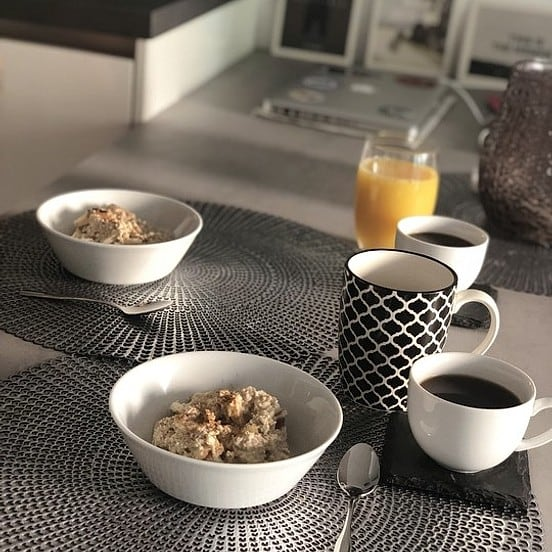

# Bestes Bircher Müsli der Welt

- 250 g Haferflocken
- 350 ml Milch
- 50 g Mandel(n) , gehackte
- 2 EL Zucker
- 2 m.-große Äpfel

1. Haferflocken (am besten Kölnflocken fein) in eine Schüssel geben. Gehackte Mandeln, Zucker und Milch hinzugeben und gut verrühren.
2. 2 mittelgroße Äpfel entkernen und schälen. Mit der Reibe (große Löcher) dem Brei hinzufügen und nochmals verrühren. Nach Geschmack mehr zuckern.
3. Abgedeckt für 3-4 Stunden in den Kühlschrank stellen, fertig.

> Ist das Müsli nach ca. 3 Stunden zu fest oder auch zu dünn, einfach noch ein wenig Milch bzw. ein bisschen Haferflocken dazu geben.
