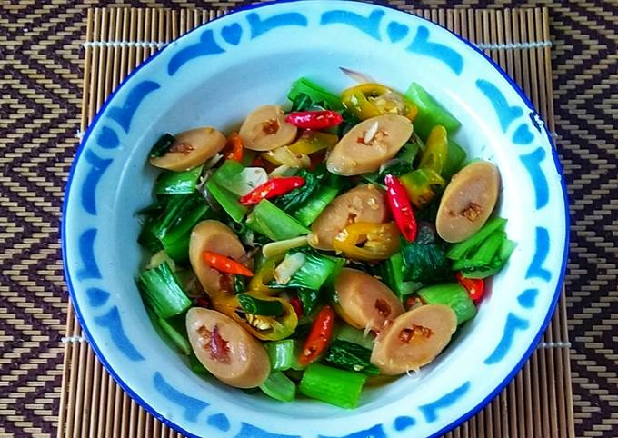

# Ca Sawi Sosis

- 1 ikat sawi hijau, potong seukuran 2-3 ruas jari
- 1 buah sosis, iris tipis
- 2 buah wortel kecil, iris tipis
- 1 batang daun bawang, iris tipis
- 2 bawang putih, iris tipis sisi lebar
- 1 bawang merah, iris tipis sisi lebar
- 2 cabai rawit, iris tipis
- 1 sdm saus tiram
- 1 sdm kecap ikan
- 2 sdt kecap asin
- 1/4 sdt kaldu ayam
- 1/4 sdt lada putih
- 3 sdm minyak kelapa

1. Panaskan wajan, tumis semua bawang hingga wangi.
2. Masukkan sosis, lalu masukkan wortel dan daun bawang, tumis sebentar.
3. Masukkan air, masak hingga setengah matang.
4. Masukkan sawi hijau.
5. Tambahkan saus tiram, kecap ikan, kecap asin, kaldu, dan lada bubuk.
6. Masukkan cabai rawit.
7. Tes rasa.
