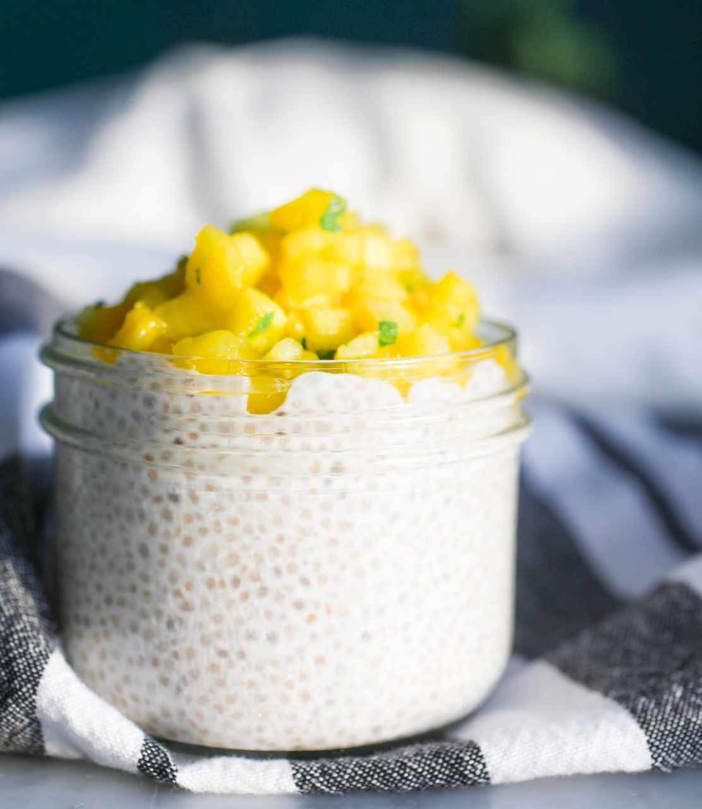

# Chia Pudding

- 2 tablespoon chia seeds
- 1/2 cup almond milk (or any other milk)
- 1 teaspoon honey or other sweetener (optional)
- Strawberries or other fruits for topping (optional)

1. Pour ingredients into a jar and mix well. Let settle for 2-3 minutes then mix again very well until you see no clumping.
2. Cover the jar and store in fridge overnight or for at least 2 hours.
3. When you're ready to eat it, top with your favorite fruit and enjoy cold!
