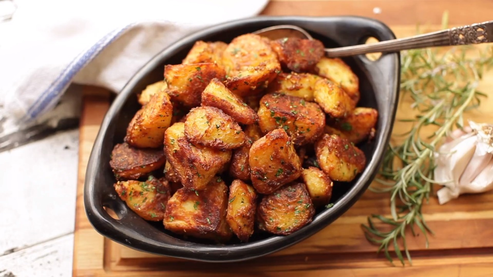

# Crispy Roasted Potatoes

- 1/2 teaspoon baking soda
- Freshly ground black pepper
- 5 tablespoonsextra-virgin olive oil, duck fat, or beef fat
- Small handful fresh parsley leaves, minced
- 3 medium cloves garlic, minced
- Kosher salt
- Small handful picked rosemary leaves, finely chopped
- 4 pounds russet or Yukon Gold potatoes, peeled and cut into quarters, sixths, or eighths, depending on size (see note above)

1. Adjust oven rack to center position and preheat oven to 450°F/230°C (or 400°F/200°C if using convection).
2. Heat 2 quarts (2L) water in a large pot over high heat until boiling.
3. Add 2 tablespoons kosher salt (about 1 ounce; 25g), baking soda, and potatoes and stir. Return to a boil, reduce to a simmer, and cook until a knife meets little resistance when inserted into a potato chunk, about 10 minutes after returning to a boil.
4. Meanwhile, combine olive oil, duck fat, or beef fat with rosemary, garlic, and a few grinds of black pepper in a small saucepan and heat over medium heat. Cook, stirring and shaking pan constantly, until garlic just begins to turn golden, about 3 minutes. Immediately strain oil through a fine-mesh strainer set in a large bowl. Set garlic/rosemary mixture aside and reserve separately.
5. When potatoes are cooked, drain carefully and let them rest in the pot for about 30 seconds to allow excess moisture to evaporate.
6. Transfer to bowl with infused oil, season to taste with a little more salt and pepper, and toss to coat, shaking bowl roughly, until a thick layer of mashed potato–like paste has built up on the potato chunks.
7. Transfer potatoes to a large rimmed baking sheet and separate them, spreading them out evenly.
8. Transfer to oven and roast, without moving, for 20 minutes. Using a thin, flexible metal spatula to release any stuck potatoes, shake pan and turn potatoes. Continue roasting until potatoes are deep brown and crisp all over, turning and shaking them a few times during cooking, 30 to 40 minutes longer.
9. Transfer potatoes to a large bowl and add garlic/rosemary mixture and minced parsley. Toss to coat and season with more salt and pepper to taste.
10. Serve immediately.
