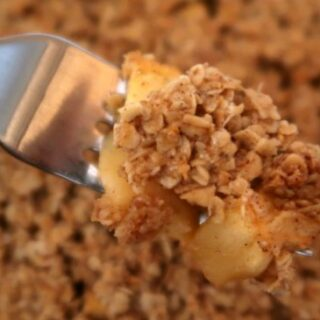

# Easy Pear Crumble

- 500g/1.1lb Pears
- 50g/1.76 oz Unsalted Butter
- 1 Cup Rolled Oats
- 1/2 teaspoon Ground Cinnamon
- 1/4 Cup Coconut Sugar
- 1/4 Cup Maple Syrup

1. Preheat the oven to 180C/350F, get out a square baking dish and be sure to grease it well.
2. Peel and chop the pears into bite sized pieces and place into the prepared baking dish so that they are ready and waitinfg for the topping.
3. Melt the butter and set aside to cool while you prepare the rest of the oaty crumble topping.
4. In a bowl combine together the oats, cinnamon and sugar until well mixed.
5. Pour the maple syrup and melted butter over the oat mixture and stir until fully incorporated.
6. Place the oat crumble topping on top of the pears, patting it down to cover the dish to each corner with topping.
7. Move the crumble to the preheated oven and bake for 25 to 30 minutes or until golden and cooked through.
8. Serve as is or with ice cream, whipped cream or pouring cream.
