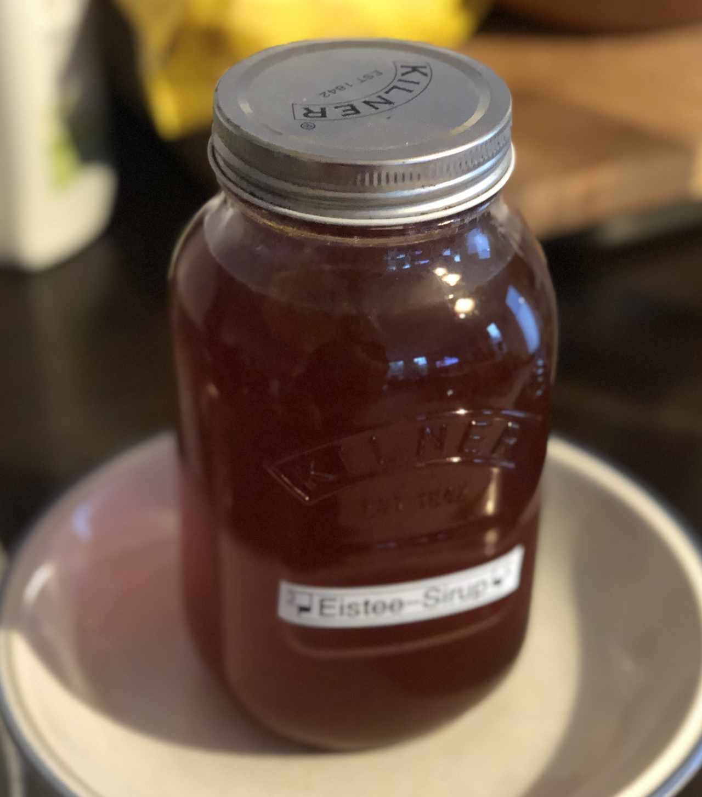

# Eistee Sirup

- 450g Zitronen
- 500g Rohrzucker
- 600ml Wasser
- 2 - 4 St. Minze
- 10gr Ear Grey Tee (lose)

- 2 x 0.7l Flaschen
- feines Sieb

1. Zitronen in Scheiben schneiden und mit Wasser in einem Topf vermengen.
2. Rohrzucker dazu geben und 10 min lang unter Rühren kochen.
3. Earl Grey Tee und Minze dazu geben. Bei ca. 80°C für 8min ziehen lassen.
4. Durch ein feines Sieb füllen und abfüllen.
5. Zum servieren etwa 1:4 / 1:5 mit Wasser mischen.

