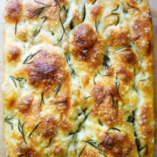

# Focaccia Bread

- 4 cups (512 g) all-purpose flour or bread flour, see notes above
- 2 teaspoons (10 g) kosher salt
- 2 teaspoons (8 g) instant yeast, see notes above if using active dry
- 2 cups (455 g) lukewarm water, made by combining 1/2 cup boiling water with 1 1/2 cups cold water
- butter for greasing
- 4 tablespoons olive oil, divided
- flaky sea salt, such as Maldon
- 1 to 2 teaspoons whole rosemary leaves, optional 

1. In a large bowl, whisk together the flour, salt, and instant yeast.
2. Add the water. Using a rubber spatula, mix until the liquid is absorbed and the ingredients form a sticky dough ball. Rub the surface of the dough lightly with olive oil. Cover the bowl with a damp tea towel, cloth bowl cover, or plastic wrap and place in the refrigerator immediately for at least 12 hours or for as long as three days. (See notes above if you need to skip the overnight rise for time purposes.) NOTE: It is important the dough really be slicked with olive oil especially if you are using a cloth bowl cover or tea towel as opposed to plastic wrap or a hard lid. If you are using a tea towel, consider securing it with a rubber band to make a more airtight cover. If you do not slick the dough with enough oil, you risk the dough drying out and forming a crust over the top layer. 
3. Line two 8- or 9-inch pie plates or a 9&amp;#215;13-inch pan (see notes above) with parchment paper or grease with butter or coat with nonstick cooking spray. (Note: This greasing step may seem excessive, but with some pans, it is imperative to do so to prevent sticking. With my USA pans, I can get away with olive oil alone; with my glass baking dishes, butter is a must.)
4. Pour a tablespoon of oil into the center of each pan or 2 tablespoons of oil if using the 9&amp;#215;13-inch pan. Using two forks, deflate the dough by releasing it from the sides of the bowl and pulling it toward the center. Rotate the bowl in quarter turns as you deflate, turning the mass into a rough ball. Use the forks to split the dough into two equal pieces (or do not split if using the 9&amp;#215;13-inch pan).
5. Place one piece into one of the prepared pans.
6. Roll the dough ball in the oil to coat it all over, forming a rough ball. Repeat with the remaining piece.
7. Let the dough balls rest for 3 to 4 hours depending on the temperature of your kitchen.
8. Set a rack in the middle of the oven and preheat it to 425°F. If using the rosemary, sprinkle it over the dough.
9. Pour a tablespoon of oil over each round of dough (or two tablespoons if using a 9&amp;#215;13-inch pan).  Rub your hands lightly in the oil to coat, then, using all of your fingers, press straight down to create deep dimples. If necessary, gently stretch the dough as you dimple to allow the dough to fill the pan.
10. Sprinkle with flaky sea salt all over.
11. Transfer the pans or pan to the oven and bake for 25 to 30 minutes, until the underside is golden and crisp.
12. Remove the pans or pan from the oven and transfer the focaccia to a cooling rack.
13. Let it cool for 10 minutes before cutting and serving; let it cool completely if you are halving it with the intention of making a sandwich.
