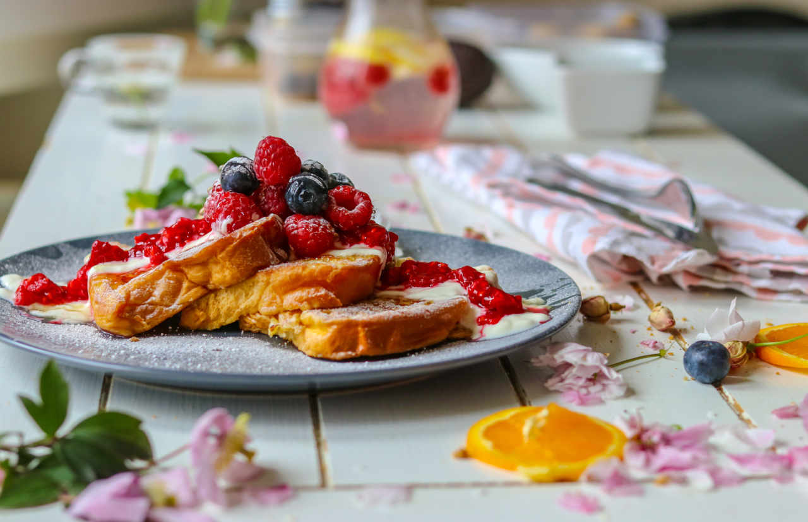

# French Toast

- 6 thick slices bread
- 2 eggs
- 1/4 teaspoon ground cinnamon (optional)
- 1/4 teaspoon ground nutmeg (optional)
- 2/3 cup milk
- salt to taste
- 1 teaspoon vanilla extract (optional)

1. Beat together egg, milk, salt, desired spices and vanilla.
2. Heat a lightly oiled griddle or skillet over medium-high heat.
3. Dunk each slice of bread in egg mixture, soaking both sides.
4. Place in pan, and cook on both sides until golden.
5. Serve hot.

# Vegan Version

[Source](http://minimalistbaker.com/basic-vegan-french-toast/)

- 1 cup unsweetened almond milk (or any non-dairy milk)
- 1 heaping Tbsp chia seeds (whole or ground into a fine meal)
- 1/2 tsp ground cinnamon
- 1/2 tsp vanilla extract
- 1/2 Tbsp agave nectar or maple syrup (or sub honey if not vegan)
- 4-5 slices bread (sturdy if possible)

1. Mix all ingredients except the bread in a large, shallow bowl.
2. Place in the fridge to activate for 10-20 minutes.
3. Preheat griddle to medium heat (~350 degrees F) and grease with 1 Tbsp vegan butter or coconut oil.
4. Dip each slice of bread in the batter for about 20 seconds on each side. If your bread is dry, leave it in a little longer. If you're using sandwich bread, it should only need 25-30 seconds total to soak.
5. Place on griddle and cook until golden brown on the underside. Carefully flip and cook until the other side is golden brown as well.
