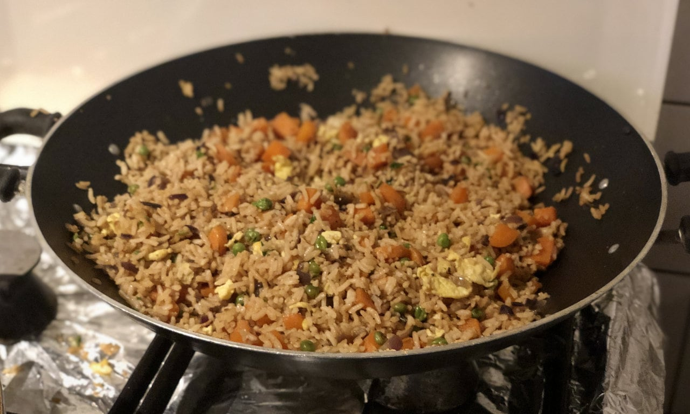

# Fried Rice

- 3 tablespoons butter, divided
- 2 medium carrots, peeled and diced
- 4 cups cooked and chilled rice (I prefer short-grain white rice)
- 2 eggs, whisked
- 3 cloves garlic, minced
- 3 green onions, thinly sliced
- 2 teaspoons oyster sauce (optional)
- 1/2 cup frozen peas
- salt and pepper
- 1/2 teaspoons toasted sesame oil
- 3-4 tablespoons soy sauce, or more to taste
- 1 small white onion, diced

1. Heat 1/2 tablespoon of butter in a large saute panover medium-high heat until melted.
2. Add egg, and cook until scrambled, stirring occasionally.
3. Remove egg, and transfer to a separate plate.
4. Add an additional 1 tablespoon butter to the pan and heat until melted.
5. Add carrots, onion, peas and garlic, and season with a generous pinch of salt and pepper. Saute for about 5 minutes or until the onion and carrots are soft. Increase heat to high, add in the remaining 1 1/2 tablespoons of butter, and stir until melted. Immediately add the rice, green onions, soy sauce and oyster sauce (if using), and stir until combined. Continue stirring for an additional 3 minutes to fry the rice. Then add in the eggs and stir to combine.
6. Remove from heat, and stir in the sesame oil until combined.
7. Serve immediately, or refrigeratein a sealed container for up to 3 days.
