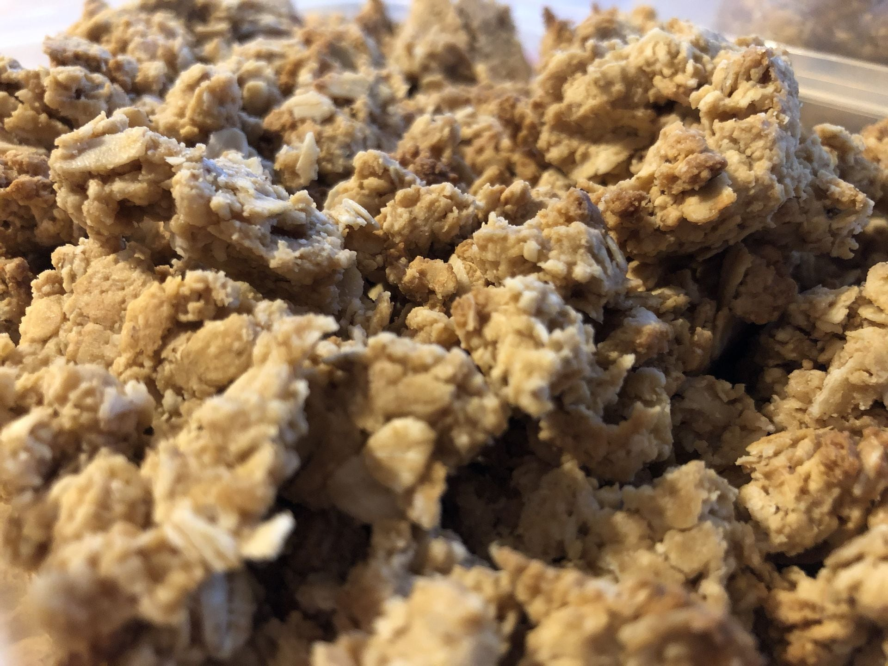
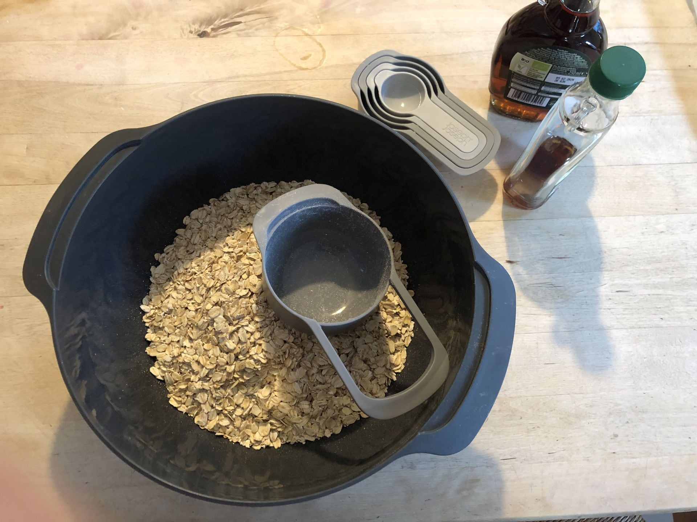
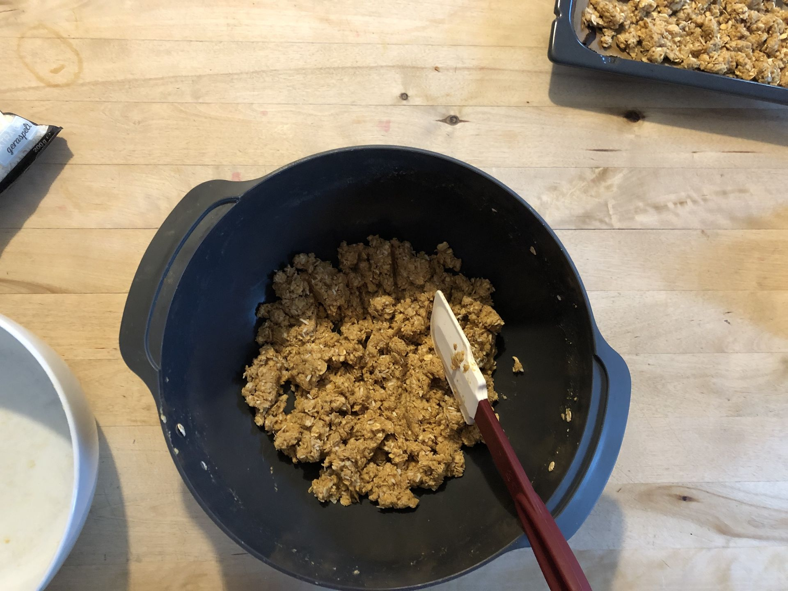
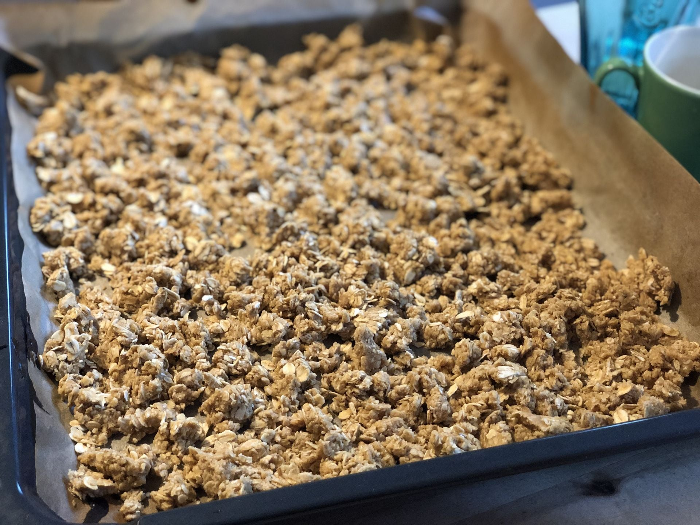
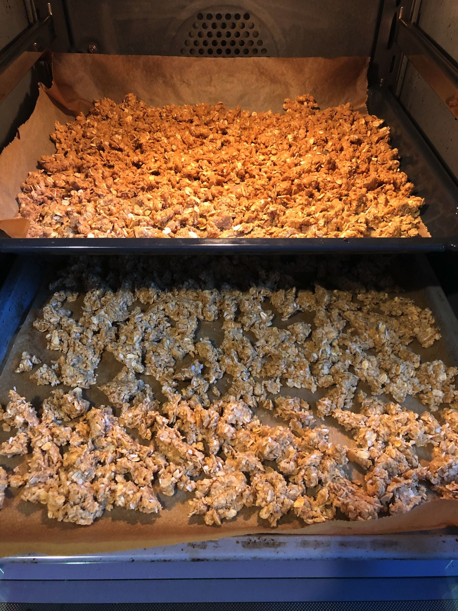
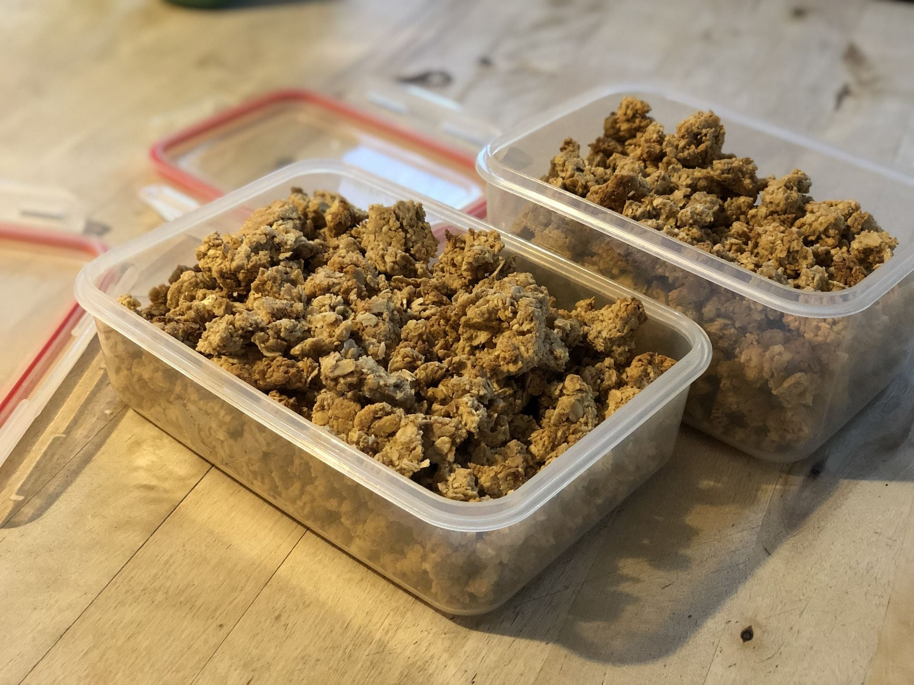

# Homemade Granola

- 2.5 - 3 cups old fashioned organic oats
- 1 cup peanut butter
- 1/2 cup maple syrup
- optional to add before baking (might need to reduce oats):
  - 1 cup assorted crushed nuts
- optional to add after baking:
  - 1/2 cup coconut flakes
  - a few tsps of seeds (sunflower or pumpkin worked well)

1. Pre-heat oven to 340 F. 
2. In a large bowl add all your wet ingredients; peanut butter and maple syrup. With a spoon mix  ingredients until they are mixed in evenly. You can tweak the later chewiness / crunchiness by *slightly* adjusting the ratios of maple syrup and peanut butter (more syrup = chrunchier, more peanut butter = chewier).
3. Add in the dry ingredients; oats, and maybe more. Then mix thoroughly.
4. You should arrive at a crumbly texture. 
5. On a lined baking sheet  spread your granola mixture and place on middle rack and bake for ~20 minutes or until golden brown. At ~10 minutes take out and mix mixture before baking for the last 10 minutes. 
6. Once golden brown, take out and cool before adding any extra ingredients.
7. Store in an air tight container and enjoy!

FUN TIP! You can take this exact recipe without baking it and make power balls or leave as a chewy granola! If making balls just roll into balls and put in your refrigerator! If it needs a bit more moisture add another scoop of peanut butter! 

