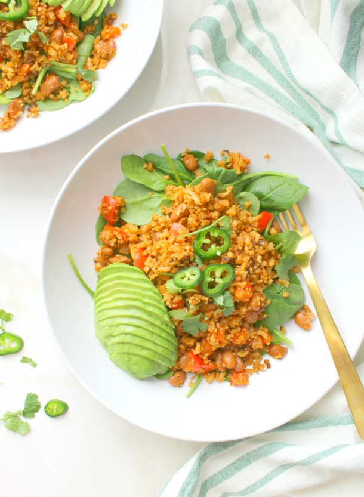

# Healthy Cauliflower Taco Bowls

> These Healthy Cauliflower Taco Bowls combine all of your favorite taco flavors in one simple recipe. Ready in just 30 minutes, this is the perfect vegan weeknight dinner!

- 1 cup water (opt.)
- 1 cup broth / bouillon
- 1 tsp olive oil
- 3 cloves garlic diced
- 1/2 red onion diced
- 1 bell pepper deseeded and diced
- 16 oz cauliflower riced
- 1 packet taco seasoning
- 1 tsp paprika
- 1 tsp chili powder
- 1 15 oz can pinto beans drained and rinsed
- salt as needed
- optional toppings spinach, cilantro, jalapeno slices, avocado

1. Combine bouillon and water in a cup. Set aside until broth is called for.
2. Heat olive oil in a pan over medium heat.
3. Add garlic, onion and bell pepper to the pan.
4. Saute until veggies become slightly tender (approx. 3-5 minutes).
5. Stir in cauliflower rice, taco seasoning, paprika, chili powder, pinto beans and broth. Bring to a bowl, then simmer on low until all of the broth is absorbed (approx. 10-12 minutes).
6. Taste and adjust seasoning as needed.
7. Remove from heat.
8. Serve cauliflower &#34;meat&#34; with any optional toppings you would like.
