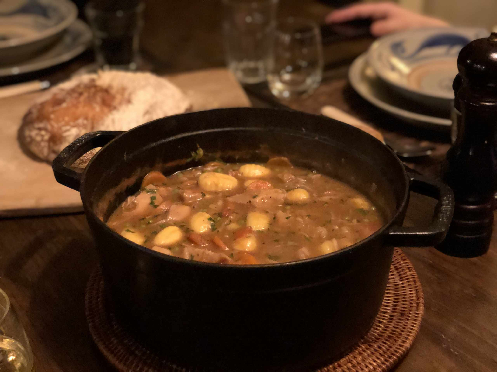

# Hearty Vegan Stew

- 1 yellow onion diced
- 2 carrots sliced into rounds
- 3 cloves garlic minced
- 2 lb jackfruit pieces rinsed well
- 1 lb gnocchi Italian potato dumplings
- 1 cup fresh tomatoes diced
- 3/4 cup frozen green peas (thawed out and rinsed)
- 8 sprigs fresh thyme
- 3 whole cloves
- 2 bay leaves
- 1 tbsp smoked paprika you can sub sweet paprika
- 1/3 cup whole wheat pastry flour
- 1/3 cup fresh Italian parsley roughly chopped
- 6 cups vegetable stock low sodium
- 1/3 cup red wine
- sea salt + black pepper to taste

1. Preheat a heavy bottom dutch oven over medium low heat and sautee the onion and carrot in a drop of oil or a splash of water until the onion is translucent. (omit oil to be WFPB &amp; Plantricious compliant).
2. Stir in the garlic and cook a few seconds until fragrant.
3. Add the jackfruit pieces, thyme, bay and the red wine. Simmer until the wine is almost evaporated.
4. Meanwhile whisk the flour with the vegetable stock until combined and add it to the pot with the jackfruit. Bring to a simmer and stir in the paprika and cloves.
5. Cook everything together for 45 minutes until the jackfruit is fork tender.
6. Stir in the gnocchi, tomatoes and green peas and cook a few extra minutes until the gnocchi float to the top and the green peas are cooked through to your liking.
7. Discard the thyme sprigs and whole cloves and season the stew to your taste with sea salt and black pepper.
8. Stir in the fresh parsley and serve!
