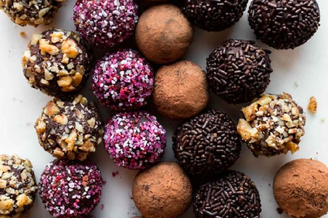

# Homemade Chocolate Truffles

- 2 4-ounce quality chocolate bars (226g), very finely chopped*
- 2/3 cup (160ml) heavy cream*
- toppings: unsweetened cocoa powder, sprinkles, crushed nuts, melted or tempered chocolate

1. Place the chocolate in a heat-proof bowl. Set aside.
2. Heat the heavy cream until it is simmering. You can heat it on the stove or in the microwave.
3. Add the butter, if using, to the chocolate and pour the heavy cream evenly on top.
4. Let the warm cream and chocolate sit for 5 minutes minutes.
5. Add the vanilla extract then stir until the chocolate has completely melted.
