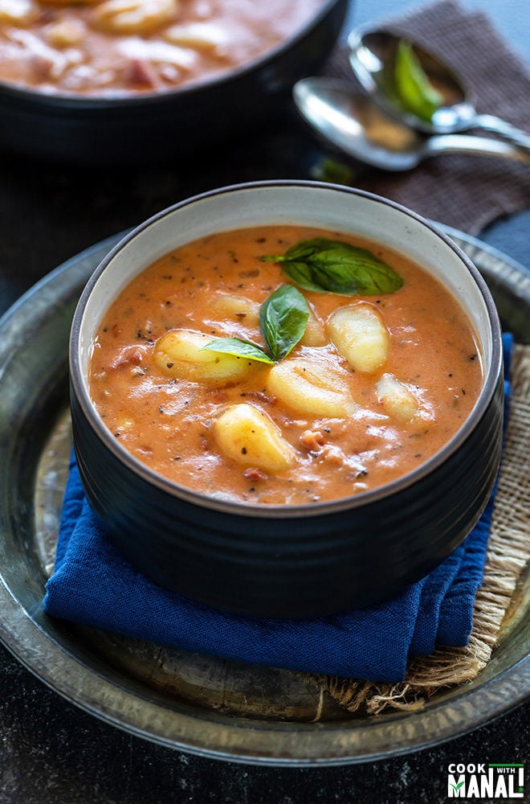

# Instant Pot Creamy Tomato Gnocchi Soup

- 1.5 tablespoons olive oil (22 ml)
- 1 medium yellow onion (chopped)
- 5-6 large garlic cloves (chopped)
- 3 cups vegetable broth (divided)
- 2 x 14.5 oz can diced tomatoes (I used fire roasted)
- 1/3 cup chopped Italian basil
- 1 teaspoon salt (or to taste)
- 1/2 teaspoon black pepper (or to taste)
- 3/4 teaspoon Italian seasoning
- 16 oz potato gnocchi, shelf stable (the one that you find in pasta aisle in grocery store)
- 1 oz cream cheese (optional)
- 1/2 cup heavy cream

1. Press the saute button on the Instant Pot. Then press the adjust button to set saute to &amp;quot;less&amp;quot;. Once it displays hot, add the olive oil.
2. Then add the onion, garlic and saute for 5 to 6 minutes until onion is soft and translucent.
3. Add 2 cups of vegetable broth and de-glaze the pot making sure there are no burnt bits stuck at the bottom. Then add 2 cans of diced tomatoes. I use fire roasted tomatoes.
4. Then add the fresh basil, salt, pepper and Italian seasoning.
5. Add in the potato gnocchi. Don&amp;#x27;t stir but press slightly so that gnocchi is under water.
6. Close the lid. Press the manual or pressure cook button and cook on high pressure for 1 minute with the pressure valve in sealing position. Quick release the pressure.
7. Open the pot and press the saute button again (press adjust to bring saute to normal since we set it to less before).
8. Add the remaining 1 cup vegetable broth and then the cream cheese (if using) and heavy cream.
9. Stir and let the soup simmer for 2 minutes. The cream cheese would also melt by then. You can add extra stock here if you want to thin out the soup further.
10. Transfer soup to serving bowls.
11. Garnish with more basil and serve.
