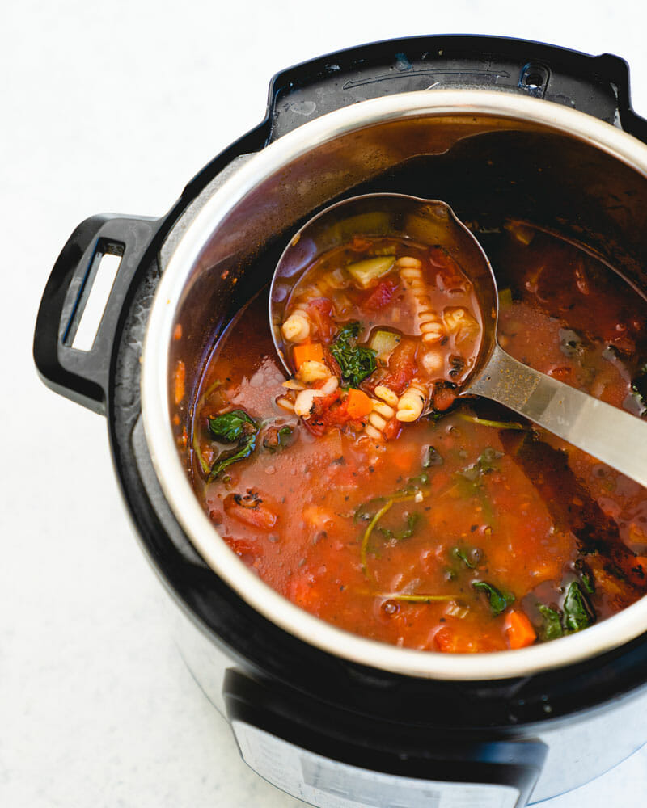

# Instant Pot Minestrone

- 1 medium onion (or leek)
- 2 medium carrots
- 1 celery rib
- 1 small zucchini squash (or 1 to 2 cups of other chopped vegetables)
- 1/4 cup olive oil
- 2 tablespoons tomato paste
- 1 quart vegetable broth
- 28-ounce can diced fire roasted tomatoes
- 1 cup water
- 1 bay leaf
- 1/2 teaspoon each dried oregano and thyme
- 1 1/2 teaspoons kosher salt, divided
- 1 15-ounce can cannellini beans
- 3/4 cup pasta shells or spirals (gluten-free or legume pasta if necessary)
- 2 garlic cloves, grated
- 3 cups baby kale (or spinach or other chopped greens)
- Fresh ground black pepper
- Fresh parsley, for garnish
- Optional topping: Parmesan cheese, basil pesto or vegan pesto
- Scale
- 1x
- 2x
- 3x

1. Prep the vegetables: Peel and small dice the onion and carrots. Small dice the celery and zucchini.
2. Turn on
3. Saute mode (on Medium) and add the olive oil to the Instant Pot. When it is heated, add the onion, carrots, celery and tomato paste, and cook for 5 to 6 minutes until the onions are just translucent.
4. Add the vegetable broth, tomatoes and juices, water, zucchini, bay leaf, oregano, thyme, and 1 teaspoon kosher salt. Lock the lid of the Instant Pot.
5. Place the pressure release handle (vent) in the “Sealing” position.
6. Cook on High Pressure for 0 minutes: Press the Pressure Cook button, making sure the “High Pressure” setting is selected, and set the time. Note that it takes about 15 minutes for the pot to “preheat” and come up to pressure before it starts cooking. (During cooking, avoid touching the metal part of the lid.)
7. Quick release: Vent the remaining steam from the Instant Pot by moving the pressure release handle to “Venting”, covering your hand with a towel or hot pad. Never put your hands or face near the vent when releasing steam. Open the pressure cooker lid. 
8. Remove the bay leaf.
9. Add the white beans, pasta, and grated garlic (you can grate it right into the pot).
10. Turn on
11. Saute mode to Low and cook until the pasta is al dente, about 8 to 10 minutes. Turn off the heat and stir in the baby greens for a few seconds until wilted. (If you’re using tougher greens like mature kale, chop them and add them in the last 5 minutes of the cook time.)
12. Add the remaining 1/2 teaspoon kosher salt. Taste and add fresh ground black pepper and more kosher salt to taste.
13. Garnish with chopped parsley (or optionally add Parmesan cheese shavings or basil pesto or vegan pesto).
