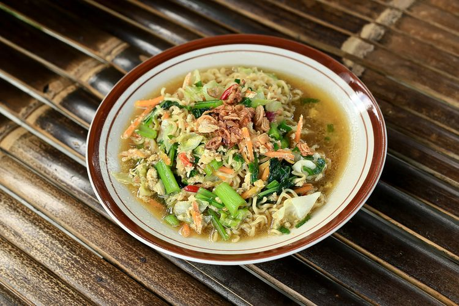

# Mie Jawa

- 1 bungkus mie burung dara
- 1 bonggol caesim/sawi
- 2 sosis
- 1 telur
- 2 cabe rawit
- 1 daun bawang
- Secukupnya bawang goreng
- Secukupnya seledri

1. Panaskan minyak, tumis bumbu halus sampai harum, masukan sosis dan goreng bersama bumbu.
2. Setelah agak matang masukan irisan cabe rawit, telur yang sudah diorak arik. Aduk rata.
3. Masukan saos sambal, saos tiram, gula, kecap, sedikit merica bubuk aduk rata, tambahkan air, aduk.
4. Masukan caesim/sawi dan mie aduk aduk hingga mie tercampur bumbu dan masak sebentar hingga sayuran matang. Tes rasa dan angkat.
5. Simpan dalam piring saji, tambahkan irisan daun bawang, bawang goreng dan seledri sesuai selera.
