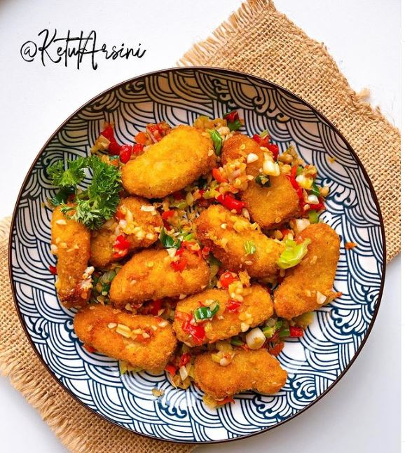

# Nugget Cabe Bawang

- 10 nugget
- 10 cabe rawit
- 10 bawang merah
- 1 daun bawang
- 1/2 sdt kaldu jamur
- 1/2 sdt garam

1. Goreng nugget.
2. Masukkan minyak kelapa ke pan, tumis cabe rawit, bawang merah, dan daun bawang hingga wangi.
3. Masukkan kaldu jamur dan garam.
4. Masukkan nugget, aduk rata.
