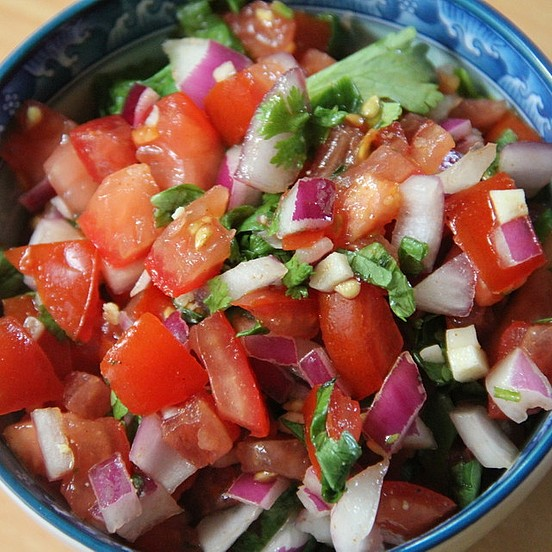

# Pico de Gallo

- 4 Fleischtomate(n)
- 1 Zwiebel(n)
- 1 Peperoni
- 1 Zehe/n Knoblauch
- 1 Bund Koriander
- 1 Limette(n)
- Salz
- Pfeffer

 1. Tomaten enthäuten, entkernen und in kleine Würfel schneiden, Zwiebel und Peperoni fein hacken, Knoblauch durchpressen, Korianderblättchen fein schneiden, alles miteinander vermischen, mit Salz, Pfeffer und Limettensaft abschmecken, 1-2 Stunden durchziehen lassen, als Beilage zu Fajitas servieren
