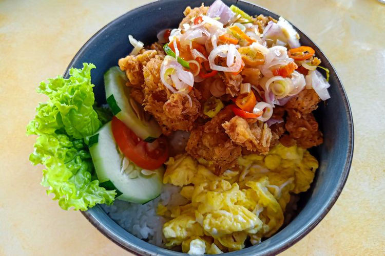

# Ricebowl Ayam Bawang

- Bahan
  - 7 buah karaage, bagi 2
  - 2 buah telur
  - 10 siung bawang merah, iris memanjang
  - 3 siung bawang putih, iris memanjang
  - 1/2 buah bawang bombay, iris memanjang
  - 3 buah cabe rawit, iris serong tipis
  - 1 buah cabe merah besar, iris serong tipis
  - 1 batang daun bawang, iris tipis
  - 1 sdt kecap asin
  - 1 sdt kaldu jamur
  - 1/2 sdt lada putih
  - Secukupnya garam

- Bahan chili oil:
  - 1 sdm chili flakes
  - 1 siung bawang merah, cincang
  - 1 siung bawang putih, cincang
  - 1 sdt kecap asin
  - 1/2 sdt kaldu jamur
  - 1/4 sdt gula
  - 1/4 sdt garam
  - Secukupnya minyak

1. Ceplok telur.
2. Goreng karaage dengan api kecil sampai matang.
3. Masukkan sedikit minyak ke pan, tumis bawang merah dan bawang putih untuk chili oil. Jika sudah wangi, matikan api. Masukkan chili flakes dan bumbu, aduk rata lalu cicipi. Nyalakan api kecil dan masak sebentar.
4. Masukkan sedikit minyak ke pan, tumis semua bahan tumisan ayam. Masak sampai wangi, masukkan bumbu. Tes rasa. Masukkan ayam, tumis sebentar hingga rata. Angkat dan sajikan.
