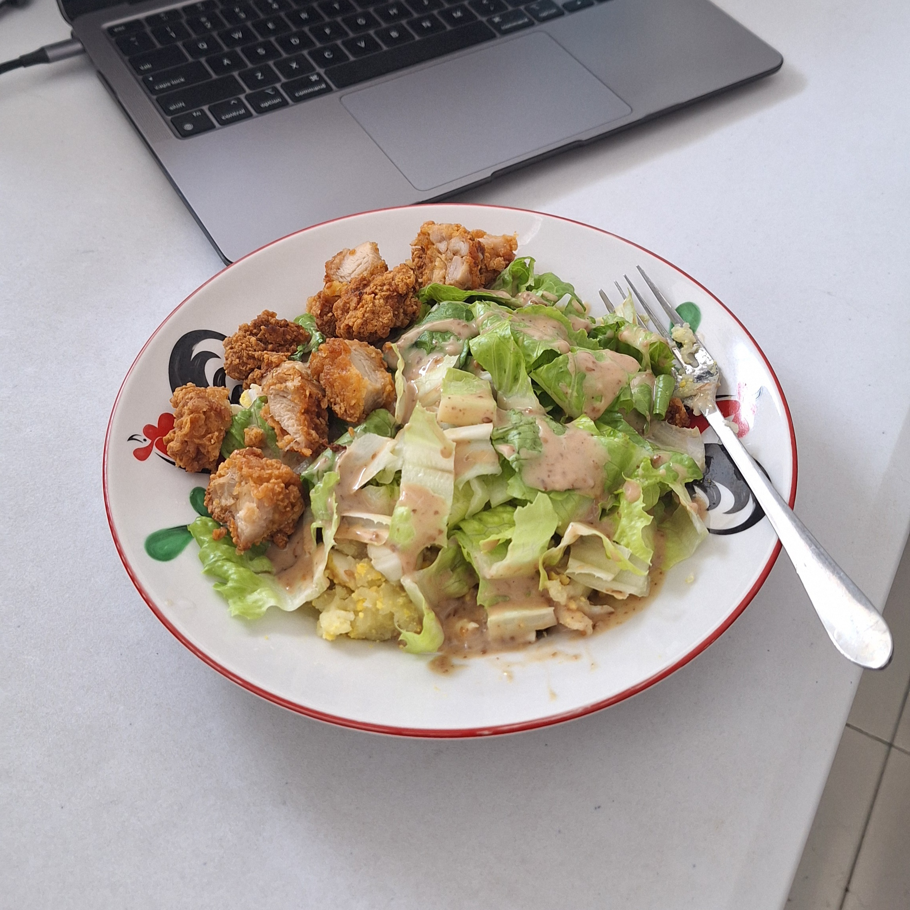

# Salad Kentang

- 2 kentang potong tipis
- 2 telur
- 6 potong karage
- Secukupnya selada, cincang

1. Kukus kentang dan telur.
2. Hancurkan kentang dan telur yang sudah dikukus dengan garpu.
3. Tambahkan selada cincang.
4. Siram dengan saus wijen dan aduk rata.
5. Tambahkan karaage.
