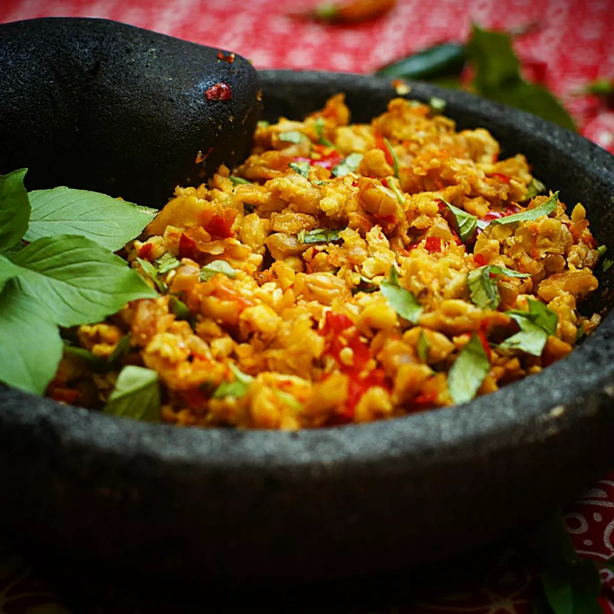

# Sambal Tempe

- 1/2 papan tempe, iris dan beri garam/bumbu tempe/ayam goreng
- 1/4 ikat kemangi
- 1 sdt gula
- 1 sdt kaldu bubuk
- 1/2 buah jeruk limau

- Bumbu ulek:
  - 15 buah cabe merah
  - 10 buah cabe rawit
  - 3 bawang merah
  - 2 bawang putih
  - 1/4 tomat merah

1. Goreng tempe yang sudah dibumbui, jangan terlalu kering.
2. Tumis sebentar bumbu ulek sampai harum.
3. Haluskan bumbu ulek, tambahkan kemangi, seasoning dan jeruk limau.
4. Ulek tempe goreng sampai halus, campur dengan bumbu ulek.
