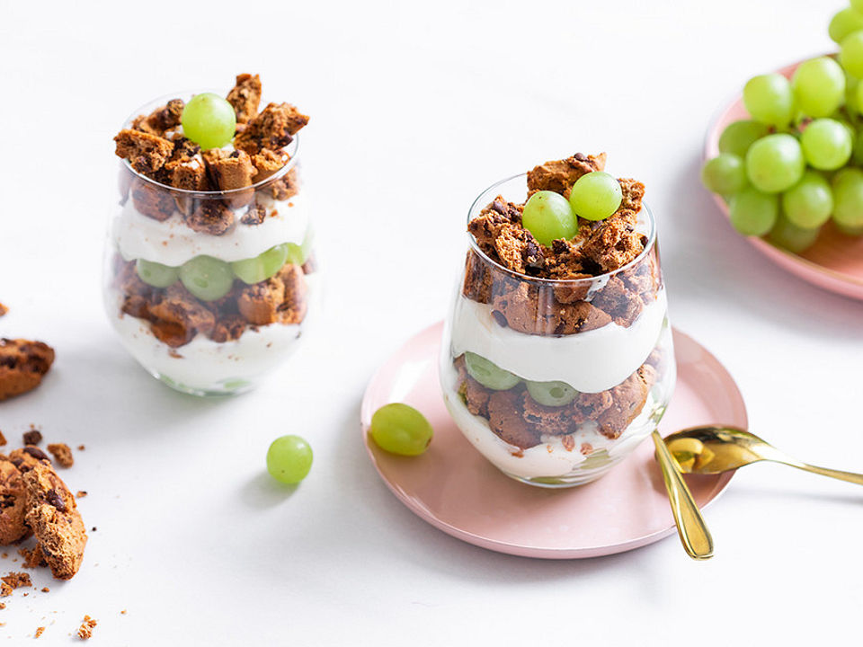

# Schichtdessert mit Weintrauben (von Juli)

- 1 kg Weintrauben , kernlose
- 250 g Quark
- 250 g Mascarpone
- 250 g Schlagsahne
- 100 g Zucker
- 2 Pck. Keks(e) (American Cookies)
- 1 Pck. Vanillinzucker

Die Sahne steif schlagen, aus Quark, Mascarpone und Zucker eine Creme zubereiten und mit der Schlagsahne verrühren. Die American Cookies zerbröseln.

In eine große Schüssel die Hälfte der Weintrauben geben, darüber die Hälfte der Creme verteilen, darauf die Hälfte der zerbröselten Cookies, danach wird alles nochmal in gleicher Reihenfolge geschichtet.

> Tipp: Am besten lässt man das Dessert noch etwas stehen, damit die Creme sich verteilen kann. 
