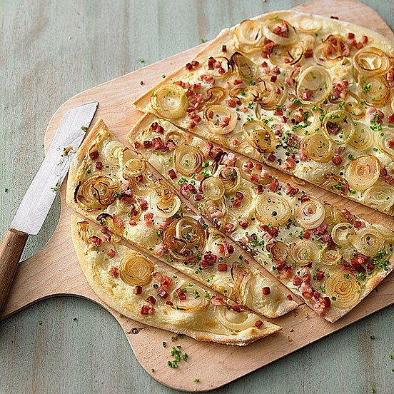

# Schneller Flammkuchen

- Teig
  - 2 EL Öl
  - 125 ml Wasser
  - 1 Prise(n) Salz
  - 250 g Mehl
- Belag
  - 100 g Speck , gewürfelt
  - 2 Zwiebel(n) , in halbe Ringe dünn geschnitten
  - 1 Becher Schmand , 24 % Fett
  - 1 Becher Crème double
  - Pfeffer
  - Salz oder Fondor
  - Schnittlauchröllchen

1. Backofen auf 250 °C vorheizen.
2. Knetteig bereiten, ganz dünn ausrollen.
3. Schmand und Crème double mischen, würzen und auf dem Teig verstreichen.
4. Zwiebeln mit ganz wenig Wasser 1 Minute bei 600 Watt in der Mikrowelle dünsten. Mit dem Speck auf dem Belag verteilen. 20 Minuten backen (untere Einschubleiste). Mit Schnittlauchröllchen bestreut servieren.
5. Wer Kalorien sparen möchte, ersetzt Crème double durch 20%igen Quark.

> Reicht für 2 - 3 Portionen, je nach Hunger.
