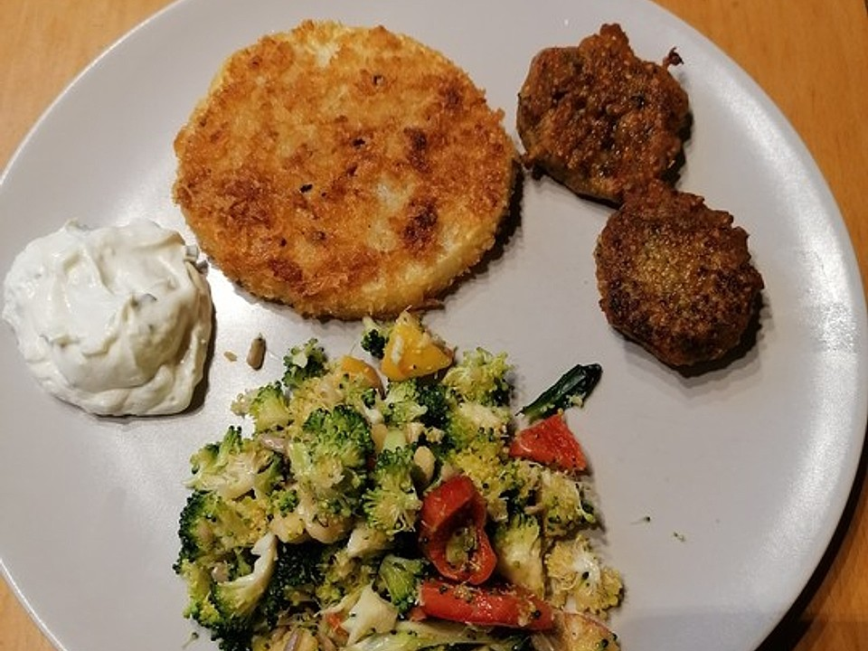

# Sellerieschnitzel

- * Bootstrap v4.0.0 (https://getbootstrap.com)
- * Copyright 2011-2018 The Bootstrap Authors
- * Licensed under MIT (https://github.com/twbs/bootstrap/blob/master/LICENSE)
- * Bootstrap v4.0.0 (https://getbootstrap.com)
- * Copyright 2011-2018 The Bootstrap Authors
- * Licensed under MIT (https://github.com/twbs/bootstrap/blob/master/LICENSE)
- @media not all{#i-amp-0{display:none}}@media not all and (max-width: 959px){#i-amp-1{display:none}}@media not all and (min-width: 960px){#i-amp-2{display:none}}

