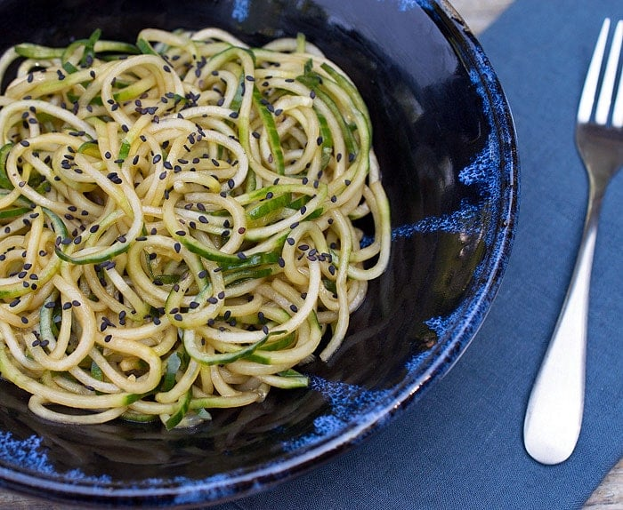

# Sesame Cucumber Noodles

- 1 large English cucumber or about 2 large regular ones
- 2 tablespoons soy sauce (tamari, (or use coconut aminos to make it soy-free and gluten-free))
- 1 tablespoons rice vinegar
- 1 teaspoon toasted sesame oil (or use tahini to make no oil added)
- 2 teaspoons toasted sesame seeds

1. Spiralize the cucumber. Break the noodles into soba-sized lengths.
2. Mix the rest of the ingredients in a medium-sized mixing bowl. Toss the noodles in and mix. Plate up and sprinkle with sesame seeds.
