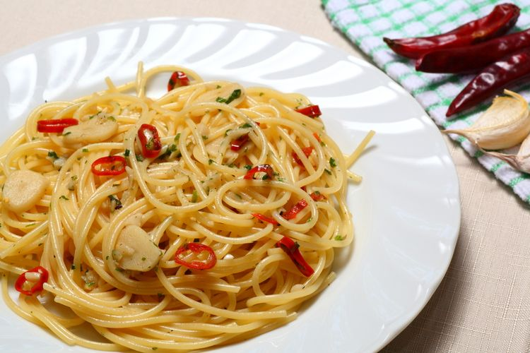

# Spaghetti Aglio Olio

- 1/3 pack spaghettini-10 450gr, atau sekitar 150 gram untuk 2 porsi
- 7 bawang putih, iris tipis sisi lebar
- 1 dada ayam, iris memanjang bagi 2, potong kotak tipis (1/2 cm) beri bumbu chicken seasoning
- 5 cabe rawit
- 2 sdt garam
- 2 sdt kaldu jamur
- 1/4 sdt merica

1. Rebus air.
2. Panggang ayam sampai matang dan agak kering luarnya.
3. Tunggu sampai satu sisi matang, balik ayam.
4. Angkat ayam, bilas pan.
5. Masak spaghetti kalau air sudah mendidih, beri sedikit garam.
6. Masukkan 3 sdm olive oil ke pan, tambahkan kalau spaghetti masih kering.
7. Tumis bawang sampai kecoklatan.
8. Masukkan ayam, aduk sebentar.
9. Masukkan spaghetti dan 4 sendok air rebusannya.
10. Tambahkan garam, kaldu, merica, dan cabe, aduk rata.
11. Cicipi, tambahkan garam/kaldu kalau masih kurang asin.
12. Tambahkan chili flakes, tambahkan italian seasoning di akhir ketika kompor sudah mau dimatikan, aduk rata.
