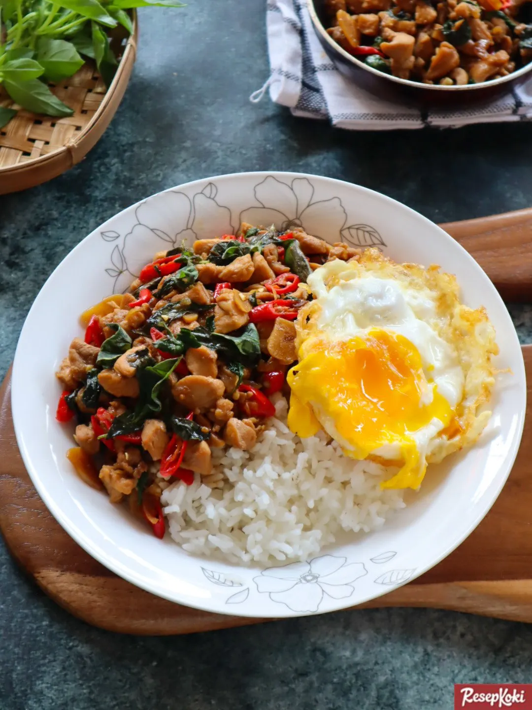

# Thai Chicken Basil

- Bahan:
  - 200 gr daging ayam giling
  - 5 siung bawang merah
  - 4 siung bawang putih
  - 1/4 buah bawang bombay
  - 4 buah cabai rawit
  - 1/2 ikat kemangi
  - 2 buah telur

- Bahan saus:
  - 2 sdm saus tiram
  - 2 sdm kecap asin
  - 2 sdm saos sambal
  - 2 sdm kecap manis
  - 1 sdt kaldu jamur
  - Garam secukupnya
  - Air secukupnya

1. Petik kemangi, ambil daunnya saja dan cuci bersih.
2. Potong bawang merah dan bawang putih memanjang. Potong cabe menyerong.
3. Cincang bawang bombay menjadi kotak-kotak kecil.
4. Jika semua bahan sudah disiapkan, ceplok 2 buah telur, sisihkan.
5. Masukkan sedikit minyak ke pan, tumis bawang merah, bawang putih, dan bawang bombay sampai wangi. 
6. Jika sudah wangi, masukkan ayam. Ratakan, jangan sampai menggumpal. Masak sampai setengah matang.
7. Kecilkan api, beri air sedikit agar ayam tidak terlalu kering. Masukkan semua bahan saus (kecuali garam), aduk sampai rata.
8. Cicipi dan tambahkan kecap atau garam jika perlu.
9. Jika rasa sudah pas, masukkan kemangi. Aduk rata sampai kemangi agak layu (jangan terlalu lama). Matikan api, sajikan dengan telur.
