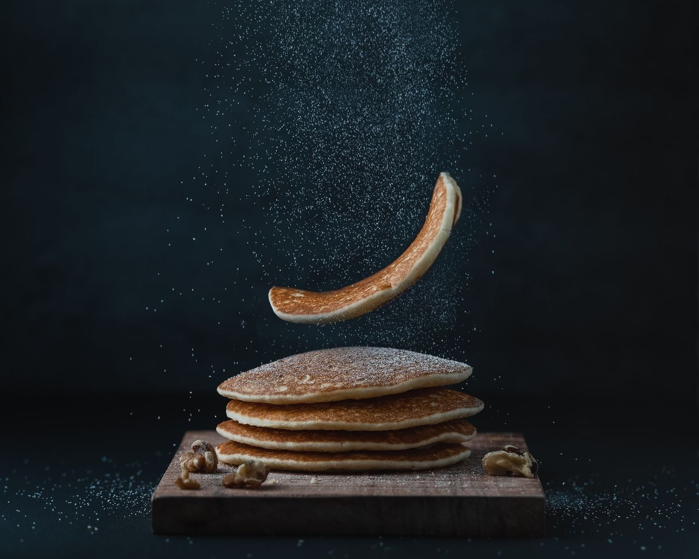

# Vegan Pancakes

- 1 cup flour
- 2 tablespoons organic sugar
- 1 tablespoon baking powder
- ½ teaspoon salt
- 1 cup non-dairy milk
- 1 tablespoon apple cider vinegar
- 1 teaspoon vanilla
- Maple syrup, to serve

1. In a medium bowl, add the flour, sugar, baking powder, and salt, and stir to combine.
2. In a medium bowl or liquid measuring cup, add almond milk, apple cider vinegar, and vanilla, and stir to combine
3. Pour the liquid mixture into the dry mixture and whisk until smooth.
4. Let batter rest for 5 minutes.
5. Pour about ½ cup (65 grams) of batter onto a nonstick pan or griddle over medium heat.
6. When the top begins to bubble, flip the pancake and cook until golden.
7. Serve warm with maple syrup.
8. Enjoy!
