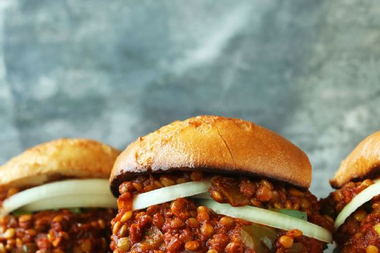

# Vegan Sloppy Joes

- 1-2 tsp chili powder, plus more to taste
- 1-2 Tbsp (12-24 g) coconut sugar, plus more to taste
- 1 cup (192 g) green lentils, well rinsed
- 2 cloves garlic, minced (1 Tbsp or 6 g)
- 2 Tbsp (30 ml) olive or grape seed oil
- 1 tsp ground cumin, plus more to taste
- optional: pinch smoked or regular paprika
- Sea salt and black pepper to taste
- 1 15-ounce (425 g) can tomato sauce*
- 2 cups (480 ml) water (I used 1 cup water, 1 cup vegetable broth)
- Gluten free or whole wheat hamburger buns*
- 1-2 Tbsp (15-30 ml) vegan-friendly worcestershire sauce* (like this brand)

1. To a small saucepan, add liquid (I used 1 cup water, 1 cup vegetable broth for added flavor) and rinsed lentils and heat over medium-high heat.Bring to a low boil, then reduce heat to a simmer and cook uncovered for about 18 minutes, or until tender. The water should have a constant simmer (not boil).
2. Drain off any excess liquid and set aside.In the meantime, heat a large skillet over medium heat. Once hot, add oil, onion, garlic, and bell pepper. Season with a pinch each salt and pepper and stir to combine.Saut for 4-5 minutes, stirring frequently, or until the peppers and onions are tender and slightly browned.Next add tomato sauce, coconut sugar, vegan worcestershire sauce, chili powder, cumin, and paprika (optional). Stir to combine.Once the lentils are cooked, add them to the skillet as well, and stir to combine.Continue cooking the mixture over medium-low heat until completely warmed through and thick, stirring occasionally - about 5-10 minutes.Taste and adjust flavor as needed, adding more chili powder and/or cumin for smokiness, salt for saltiness, coconut sugar for sweetness, or worcestershire for depth of flavor.
3. Serve the mixture on toasted buns with sliced onion. Best when fresh, though leftover sloppy joe mixture will keep in the refrigerator up to 3 days. Reheat in the microwave, or on the stovetop, adding water if the mixture has dried out.
