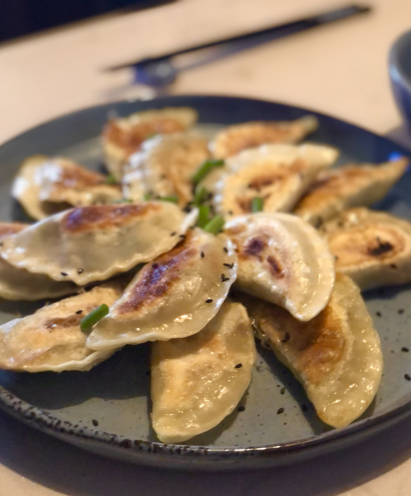

# Vegetable Dumplings / Gyoza

- Vegan Dumpling Wrapper (or use store-bought Wrappers)
  - 2 ½ cups all-purpose flour (300g)
  - ½ tsp salt
  - ⅔ cup hot water (160ml)
  - cornstarch or flour dusting the work surface
- Vegetable Filling
  - 1-2 tbsp sesame oil
  - 2 cloves garlic minced
  - 1 tbsp ginger minced
  - 1 onion diced
  - 1 carrot (100g) shredded
  - 7 oz mushrooms (200g) finely chopped
  - ½ stick leek (60g) finely chopped
  - 7 oz cabbage (200g) shredded
  - 2 tbsp soy sauce
  - 1 tbsp rice vinegar
  - salt and pepper to taste
  - 1 tsp sriracha or sambal oelek (optional)
- Dipping Sauce
  - 3 tbsp soy sauce
  - 1 tbsp rice vinegar
  - 1 tbsp agave syrup
  - ¼ tsp sesame oil
  - ½ tsp sriracha or sambal oelek (optional)
- For Garnish
  - 1 tbsp toasted sesame seeds
  - 2 tbsp spring onions sliced

## Dumpling Wrappers

1. Mix the flour and salt in a bowl. Add the water while stirring to combine. Transfer to a working surface and knead for about 3-5 minutes until you have a smooth and soft dough. Form into a ball, wrap in cling film and refrigerate for 30 minutes.
2. Divide the dough into two pieces (This makes it easier to roll out). Dust the working surface with a little cornstarch and roll out the dough into about 2mm (1/14-inch) thick.
3. Cut out circles using a glass or cookie cutter (mine is 3-inch wide/ 8cm). Remove the trim, knead it into a ball, and roll it out again to cut out more circles.
4. Dust the wrappers with some cornstarch before stacking them up, otherwise they will stick together.
5. Use them right away or store in an airtight container in the fridge or freeze.

## Veggie Filling

1. Finely chop the veggies and heat the oil in a large pan.
2. Add the mushrooms, onions, and carrots and fry for 2-3 minutes until lightly browned. Then add the leek and cabbage with a little salt and cook for further 5-7 minutes, or until veggies are soft and cooked through, stirring occasionally, adding a little water if needed. Add the garlic, ginger, and seasonings and cook for a further minute to combine the flavors.
3. Set aside to cool.

## Fold Gyoza

1. Add 1 heaped teaspoon of filling to the center of the dumpling wrapper. Brush the edges with water and fold the dumpling creating hand fan pattern or as desired (see step-by-step pictures or recipe video in the text above), making sure to seal the seams.
2. Repeat until the wrappers are used up.
3. Now you can freeze the uncooked gyoza (see recipe notes*) or cook them.

## Cook Gyoza

1. Heat the oil in a pan over medium heat. Add the gyoza and fry for 2-3 minutes or until the bottoms are nicely browned. Pour in about 1/4 cup of water and cover with a lid. Steam for 7-8 minutes or until the water has evaporated.

## Dipping Sauce

1. Mix all ingredients for the dipping sauce together.
2. Sprinkle the gyoza with sesame and chopped spring onions and serve with the sauce. Enjoy!