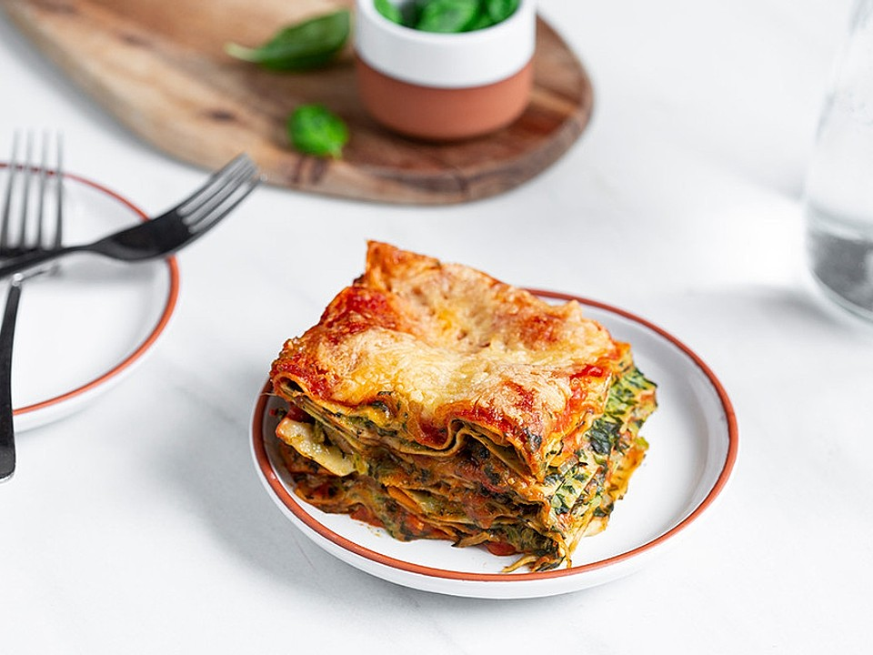

# Vegetarische Spinat-Gemüse-Lasagne mit Tomatensoße

- 600 g Blattspinat, TK , mit Rahm
- 2 große Karotte(n)
- 7 m.-große Champignons
- 1 große Zwiebel(n)
- 5 EL Milch
- 2 Knoblauchzehe(n)
- Salz und Pfeffer
- Chilipulver
- 3 EL Butter
- 2 EL Mehl
- 500 ml Tomaten, passierte
- 150 ml süße Sahne
- 200 g Käse, gerieben
- ½ Pck. Kräuterfrischkäse , ca. 100 g
- 1 EL, gestr. Gemüsebrühepulver
- 1 Paket Lasagneplatte(n)

