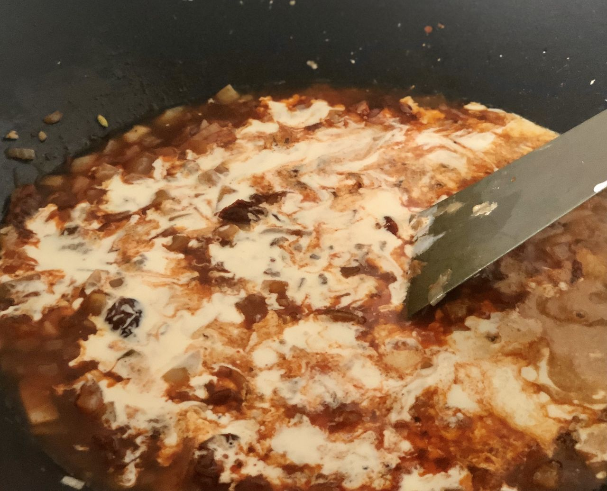

# Pasta á la James with Aubergine, Sun-Dried Tomatoes, Italian Cheese and Basil

- 2 Aubergine(s)
- 360 g Penne
- 100 g Grated Italian Hard Cheese e.g. Pecorino, Parmesan, Grano Pandano
- 160 g Rucola (roughly)
- 140 g Semi-dried Tomatoes
- 2 Onions
- 2 pieces of Garlic
- 4 tsp Paprika Powder
- 200 ml Cream
- 20 g Fresh Basil
- 240 ml Vegetable Stock / Broth
- 2 tbsp Balsamico Vinegar (black)
- Some Olive Oil (for frying)
- Salt & Pepper to taste

1. Cook the pasta in slightly salted water.
2. Prepare the broth.
3. Cut the aubergine in pieces of 1 - 2 cm. Cut the onion, press or cut the garlic into small pieces. Cut the semi-dried tomatoes into roughly pieces.
4. Fry the Aubergine in a pan with 2 - 4 tbsp of olive oil over medium heat for 8 - 10 minutes until it is brown all across.
5. At the same time, fry the onion, garlic and tomatoes in a separate pan for 3 - 4 minutes over medium heat. Add the paprika and fry for another minute. Add the balsamico vinegar and vegetable stock, followed by the cream and cook for another 4 - 5 minutes.
6. Mix the aubergine and 2/3 of the cheese into the sauce. Cut the basil and add the majority of it into the sauce, saving the rest for garnishing. Add salt and pepper to taste.
7. Serve the pasta on a bed of rucola, garnished with more rucola on top, as well as the rest of the basil and italian cheese. The pasta and sauce can be combined in the pan or combined on top of each other.